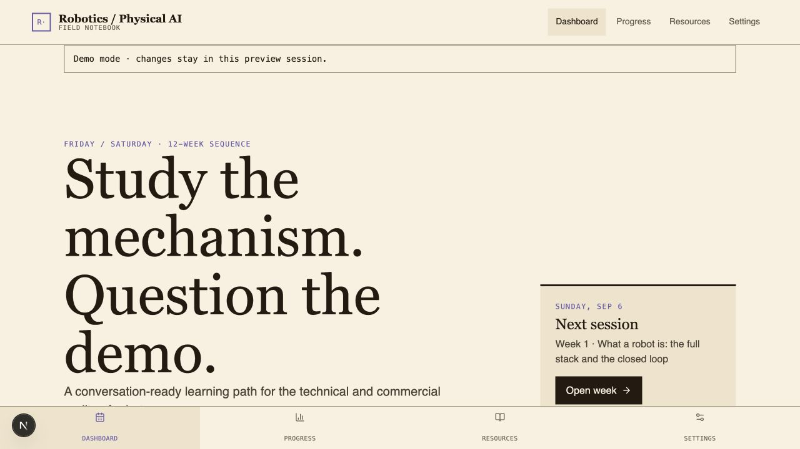
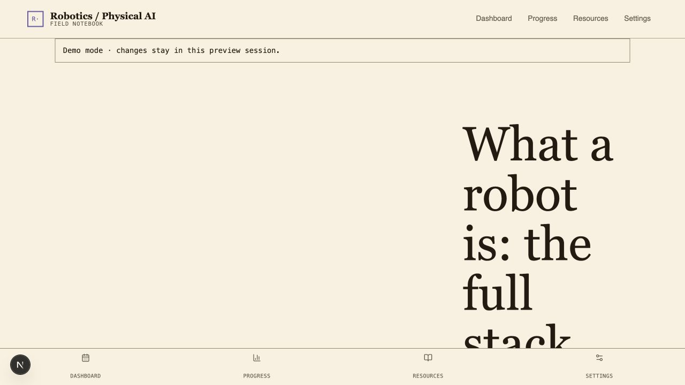
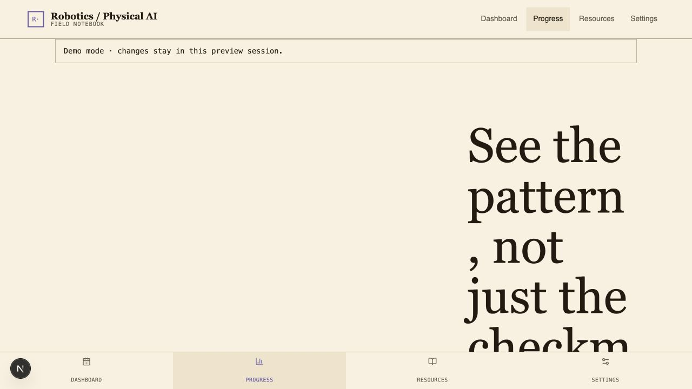
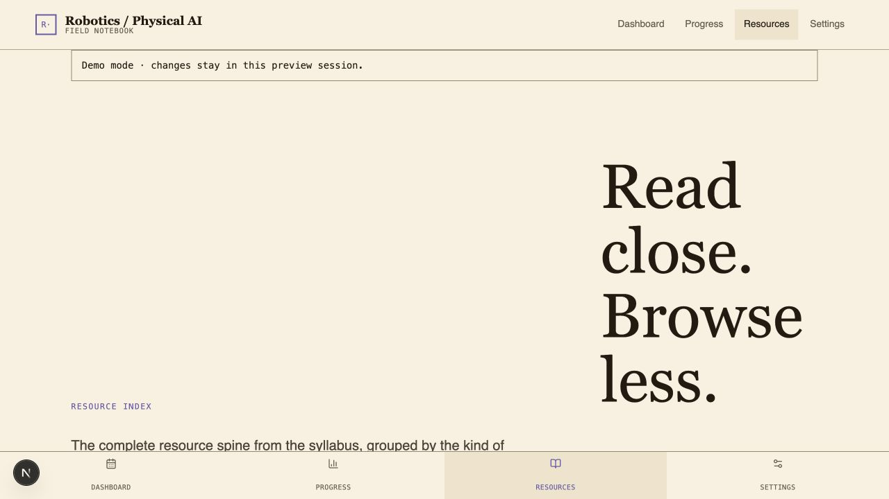
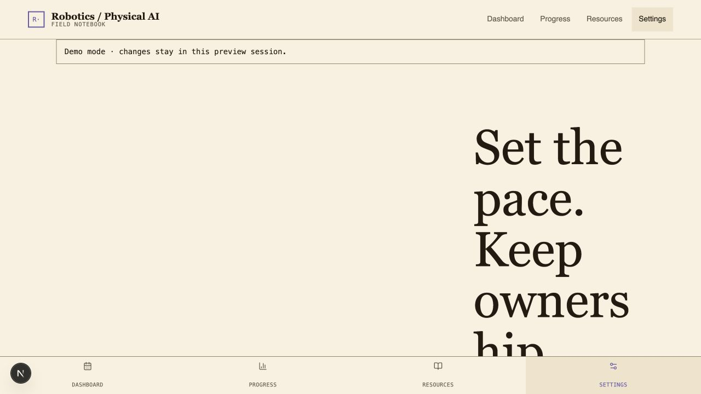

# Robotics & Physical AI Learning Tracker

A private Friday/Saturday notebook for the 12-week syllabus in [`robotics-physical-ai-learning-path.md`](./robotics-physical-ai-learning-path.md). The tracker keeps activity completion, conversation briefs, confidence, time, milestone scores, and open questions in owner-scoped Firestore documents.

[Open the production app](https://robotics-learning-tracker.vercel.app/login)

## Purpose

This project turns a broad robotics reading list into a repeatable learning practice. It is designed for someone who wants enough mechanism-level understanding to have sharper conversations with robotics founders, engineers, practitioners, and investors—not to become a robotics researcher in twelve weeks.

The learning loop is deliberately simple:

1. **Friday — understand the mechanism.** Follow a curated sequence through embodiment, kinematics, control, estimation, planning, perception, robot learning, hardware, and deployment economics.
2. **Saturday — connect it to Physical AI.** Inspect a real system, paper, or demo and identify what is observed, planned, learned, controlled, hidden, or still unproven.
3. **Write a conversation brief.** Capture the mechanism, loop position, tradeoff, evidence, failure mode, business implication, and questions for a founder, engineer, and investor.
4. **Retrieve and reassess.** Track confidence, revisit open questions, and score conversation readiness at Weeks 4, 8, and 12.

The app keeps the curriculum in Git while storing only the signed-in user's progress and notes in Firebase. This makes the learning material reviewable and the personal notebook private.

## Visual proof

The screenshots below were captured from the implemented application using its explicit local demo fixture. They contain no personal Firebase data. The Week 1 image represents the shared `/week/[number]` template used for all 12 curriculum weeks.

<details>
<summary><strong>Login</strong> · <code>/login</code></summary>


</details>

<details>
<summary><strong>Dashboard</strong> · <code>/</code></summary>



</details>

<details>
<summary><strong>Week workspace</strong> · <code>/week/1</code></summary>



</details>

<details>
<summary><strong>Progress</strong> · <code>/progress</code></summary>



</details>

<details>
<summary><strong>Resources</strong> · <code>/resources</code></summary>



</details>

<details>
<summary><strong>Settings</strong> · <code>/settings</code></summary>



</details>

## Resources and how they support the learning path

### Curriculum backbone

| Resource | Role in the track |
|---|---|
| [Princeton ROB 345/549](https://irom-lab.princeton.edu/intro-to-robotics/) and its [video lectures](https://www.youtube.com/@intro-to-robo) | The main end-to-end spine. Lectures, notes, assignments, and projects connect classical robotics to SLAM, robot learning, VLAs, and world models. |
| [Cornell CS 4750/5750 Foundations of Robotics](https://www.cs.cornell.edu/courses/cs5750/2025fa/) | Provides the system-level sequence for state estimation, planning, and control, helping the learner trace how a robot closes the loop. |
| [Berkeley EECS C106A/206A](https://pages.github.berkeley.edu/EECS-106/fa25-site/) | Builds vocabulary and intuition for rigid-body motion, kinematics, Jacobians, vision, dynamics, and controls. |
| [Modern Robotics](https://hades.mech.northwestern.edu/index.php/Modern_Robotics) | A free reference with a textbook, videos, exercises, and code for revisiting mathematical mechanisms without making coding the goal. |
| [Interlatent: Modern AI Robotics from First Principles](https://interlatent.com/blog/interlatent-modern-ai-robotics-first-principles) | Frames modern robotics as observation-to-action learning under real-time physical constraints, bridging classical robotics and Physical AI. |

### Selective depth and practical context

| Resource | Role in the track |
|---|---|
| [Princeton public assignments](https://github.com/Princeton-Introduction-to-Robotics/F2023) | Optional implementation practice when a concept needs to become concrete. Hardware-specific work is not required for the conversation-ready goal. |
| [MIT Underactuated Robotics](https://underactuated.mit.edu/) | Adds deeper intuition for dynamics, optimization, and control when the primary material is not enough. |
| [ROS 2 documentation](https://docs.ros.org/) | Shows how sensing, computation, communication, and actuation are assembled in a production robot software system. |
| [Hugging Face LeRobot](https://huggingface.co/docs/lerobot/index) | Makes robot-learning datasets, imitation and reinforcement-learning policies, simulation, and open models inspectable. |
| [Planning Algorithms](https://lavalle.pl/planning/) | A free reference for graph search, configuration spaces, and sampling-based motion planning. |
| *Probabilistic Robotics* | The reference layer for uncertainty, localization, state estimation, and SLAM. |

### Obsidian vault and industry judgment

The private `Obsidian Vault/Hanif's Brain` material supplies the ongoing industry layer: autonomy levels, the robotics stack, data bottlenecks, foundation models, deployment economics, markets, and where value may accrue. The tracker names the relevant vault notes in each week but does not copy private vault content into the repository.

This layer helps turn course knowledge into better diligence questions: What is scripted versus learned? What happens outside the demo distribution? How often does a human intervene? Which bottleneck moves at fleet scale? Where is the defensible data or workflow advantage?

### Product and interface references

| Resource | Contribution |
|---|---|
| [Hallmark](https://github.com/Nutlope/hallmark) | Guided the editorial, technical-field-notebook direction and the hierarchy around resuming the next learning session. |
| [Awesome Design Systems](https://github.com/alexpate/awesome-design-systems/blob/master/README.md) | Informed reusable tokens, interaction states, accessibility, and component consistency. |
| [Online Learning App UI](https://dribbble.com/shots/26895073-Online-Learning-App-UI-Design) | Supplied loose inspiration for course progress, calendar cues, soft surfaces, and calm pacing; no assets or pixel layouts were copied. |
| [shadcn/ui](https://ui.shadcn.com/) and [Lucide](https://lucide.dev/) | Supplied accessible interaction patterns and a restrained icon vocabulary while keeping the visual system project-specific. |
| [Firebase](https://firebase.google.com/docs) and [Vercel](https://vercel.com/docs) | Provide private Google identity, owner-scoped persistence, and a deployable web surface that makes the Friday/Saturday habit available anywhere. |

## Local setup

Requirements: Node.js 22.x and npm.

```bash
npm install
cp .env.example .env.local
npm run dev
```

The app is fail-closed by default. Missing Firebase variables show an unconfigured login screen; no implicit demo user is created.

### Explicit demo mode

For a local preview only, set this in `.env.local`:

```dotenv
NEXT_PUBLIC_DEMO_MODE=true
```

Demo mode is honored only when `NODE_ENV` is `development` or `test`; it is never enabled in a production build. Demo changes are held in memory and are not a substitute for Firestore persistence.

## Firebase setup

1. Create a Firebase project and a Web app in the Firebase console.
2. Enable Authentication → Sign-in providers → Google.
3. Add `localhost` and your deployed domain under Authentication → Settings → Authorized domains.
4. Create Firestore in region `us-west2` (or update the region to match your project policy).
5. Copy the Web app’s public configuration into `.env.local` using [`.env.example`](./.env.example). These are client-side Firebase values, not admin credentials.
6. Deploy the Google provider configuration, owner-only rules, and indexes:

```bash
npx firebase login
npx firebase use YOUR_PROJECT_ID
npx firebase deploy --only auth,firestore
```

`.firebaserc` targets the non-secret Firebase project ID `robotics-tracker-hanif-906`. Use `firebase use YOUR_PROJECT_ID` when deploying a fork. Never commit service-account keys or admin credentials.

## Emulator and tests

```bash
npm run typecheck
npm run lint
npm test
npm run test:rules
npm run test:e2e
npm run build
```

`test/firestore-emulator.test.ts` is the real rules test. `npm run test:rules` starts the Firestore emulator, checks unauthenticated/other-user denial, owner access to user/week/milestone paths, and unexpected-root denial. The static rules test is a lightweight fallback when no emulator is running.

## Deployment (Vercel)

Import this repository into Vercel (the included [`vercel.json`](./vercel.json) selects Next.js), add all `NEXT_PUBLIC_FIREBASE_*` variables in the correct Production/Preview environments, and add the Vercel domain to Firebase Authorized domains. Keep Deployment Protection enabled for Preview deployments if the notebook contains real learning notes. Do not set `NEXT_PUBLIC_DEMO_MODE=true` in Production.

## Data, exports, and reset

The app writes only to `users/{uid}`, `users/{uid}/weeks/{weekId}`, and `users/{uid}/milestones/{checkpointId}`. Firestore rules deny all other roots and require the signed-in UID to match the document owner. Settings provides Markdown and schema-versioned JSON exports generated in the browser. Reset requires typing `RESET MY NOTEBOOK` and deletes the signed-in user’s week/milestone documents; export first if you need a copy.

This is a private notebook, not a compliance system. Review Firebase region, retention, access, Google account, and Vercel preview settings for your own privacy requirements. The app does not use admin APIs, service-account credentials, or persistent offline caching.
